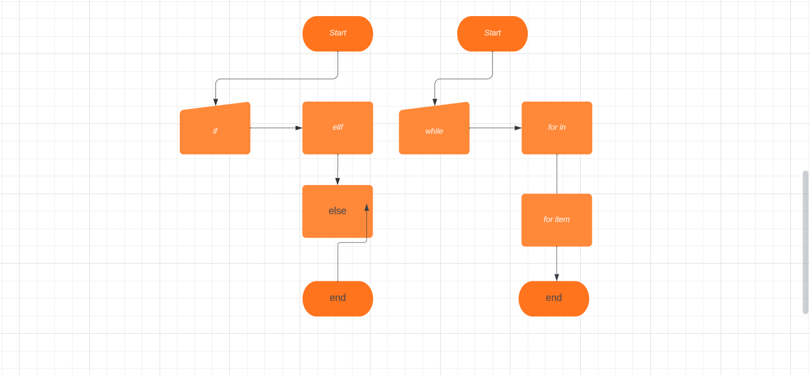
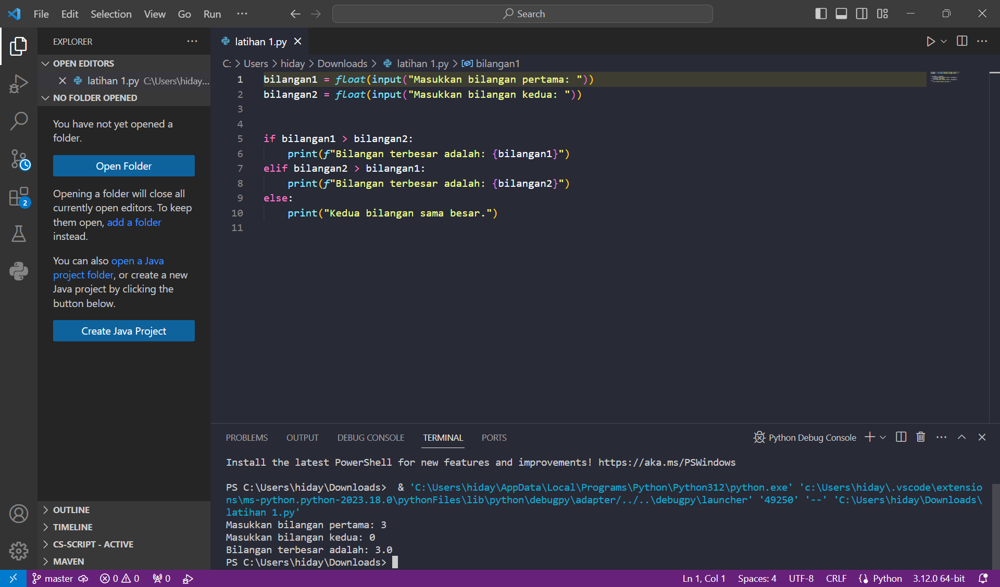
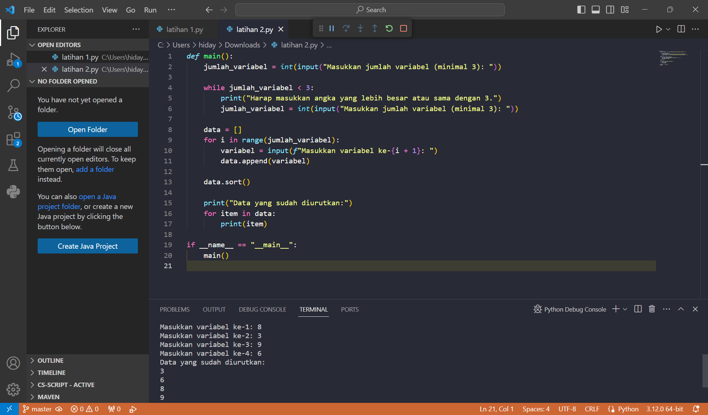
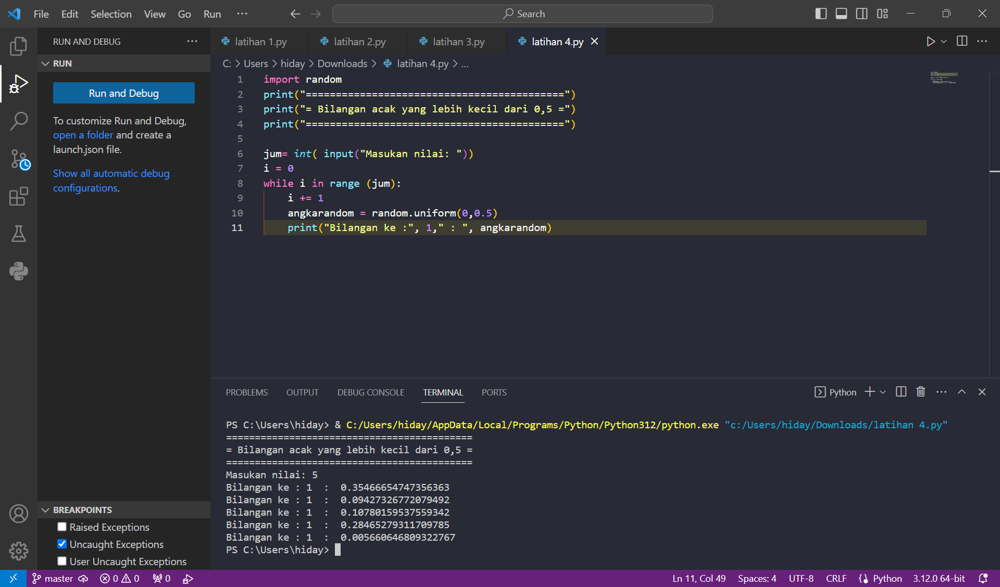
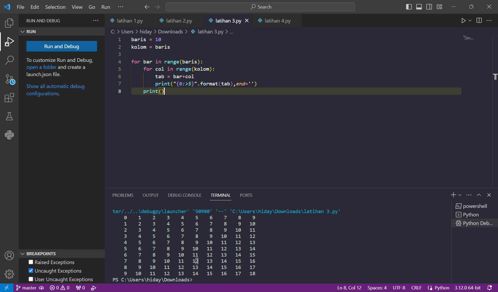

# LANGKAH LANGKAH STRUKTUR KONDISI
  
1. if adalah struktur kondisi dasar ia mengeksekusi blok kode yang ada di bawahnya hanya jika kondisi yang diberikan bernilai True.

2. Elif Singkatan dari "else if". Ini digunakan untuk mengecek kondisi lain jika kondisi dalam if sebelumnya bernilai False.

3. Else Blok kode di bawah else akan dijalankan jika semua kondisi dalam if dan elif sebelumnya bernilai False.

# LANGKAH-LANGKAH PERULANGAN

1. Perulangan dengan "for"

2. Perulangan dengan while

3. Kontrol Perulangan

FLOWCHART

STRUKTUR KONDISI LATIHAN 1

STRUKTUR KONDISI LATIHAN 2

PERULANGAN LATIHAN 1

PERULANGAN LATIHAN 2

